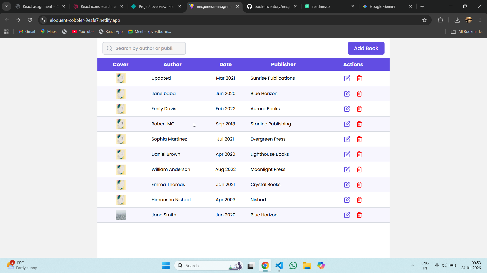

#### 🔗 Links

[Take a preview](https://nexgenesisassignment.netlify.app/)

# Book Inventory Management System

The Book Inventory Management System is a web application built using React that allows users to efficiently manage a collection of books. It provides a user-friendly interface for performing CRUD (Create, Read, Update, Delete) operations on the inventory of books. The application fetches book data dynamically from an API and displays it on the landing page, allowing users to view detailed information about individual books with ease.

## Features

1. **Landing Page / Home Page**
   - Displays a list of all books available in the inventory.
   - Shows a summary of each book's information, including the **publisher**, **published date**, **author**, **cover Image** and others.
   - Provides access to **CRUD operations** directly from the landing page.
2. **API Integration**
   - Fetches book data dynamically using an API.
   - Ensures the inventory is always up-to-date with the latest collection.

3. **Book Details Page**
   - Clicking on a book redirects to a **details page**.
   - Displays comprehensive information such as **author name, published date, publisher**, and an **overview of the book's content**.

4. **Responsive and Interactive Design**
   - Fully responsive and adapts seamlessly to different screen sizes and devices.
   - Provides an interactive, user-friendly experience for easy navigation and action.

5. **Table Display**
   - Data is presented in **organized tables** for clear readability and management.

6. **Scrollable Pages**
   - Long lists of books and detailed information are **scrollable**, improving accessibility and usability.

7. **Data Validation**
   - Ensures that user inputs are **properly validated** to maintain data integrity and prevent errors.
8. **API Loading State**

- Displays a loading indicator while fetching data from the API.
- Enhances user experience by showing feedback when the content is being loaded.

9. **React Toastify Notifications**

- Provides real-time feedback for user actions such as adding, updating, or deleting a book.
- Displays success, error, or warning messages in a user-friendly toast popup.
- Improves interactivity and keeps users informed about the status of their actions.

## Tech Stack

1. **Frontend:** React, Tailwind CSS, React Icons, Toastify
2. **API Integration:** RTK Query
3. **State Management:** Redux Toolkit, React Hooks (useState, useEffect)
4. **Backend:** JSON-Server / Render

## Running the Project Locally

Follow these steps to set up and run the **Book Inventory Management System** on your local machine.

### 1. Clone the repository

```bash
git clone https://github.com/your-username/book-inventory.git
```

### 2. Navigate to the project folder

```bash
cd book-inventory
```

### 3. Install dependencies

```bash
npm install
```

or

```bash
yarn
```

### 4 Environment Variables

To run this project, you will need to add the following environment variables to your .env file

> **Note:** This is a public project created for demonstration purposes. The real API is included to showcase full functionality.

`VITE_API_URL`=https://json-server-deployment-3wy6.onrender.com/

### 5. Start the development server

```bash
npm start
```

or

```bash
yarn start
```

### 6.Open in Browser

```bash
http://localhost:3000
```
